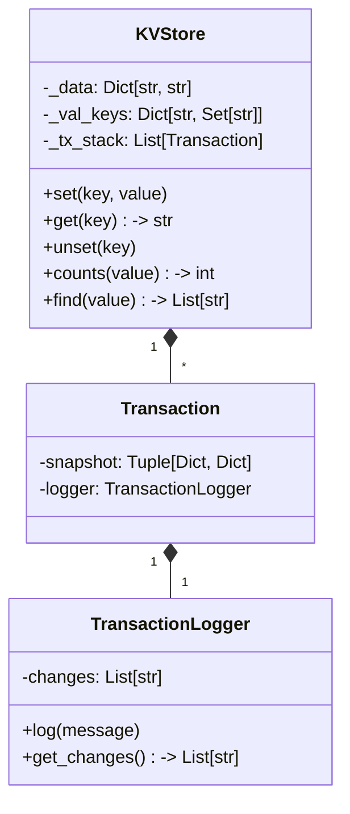

# In-Memory Key-Value Store with Transactions


A lightweight in-memory key-value database with transaction support, written in Python.

## Table of Contents
- [Features](#features)
- [Installation](#installation)
- [Usage](#usage)
  - [Basic Commands](#basic-commands)
  - [Transaction Commands](#transaction-commands)
- [Examples](#examples)
- [Architecture](#architecture)
- [Limitations](#limitations)
- [Contributing](#contributing)


## Features ✨

- **CRUD Operations**:
  - `SET`/`GET`/`UNSET` key-value pairs
  - Value-based search with `FIND`
  - Count occurrences with `COUNTS`

- **Transaction Support**:
  - Nested transactions
  - Atomic commits/rollbacks
  - Transaction logging

## Installation ⚙️

```bash
git clone git@github.com:RiRinat/test_DrWeb_web.git
chmod +x deploy.sh
./deploy.sh
```
## Usage 🖥️

### Basic Commands

| Command   | Syntax              | Description                     |
|-----------|---------------------|---------------------------------|
| SET       | `SET <key>:<value>` | Stores key-value pair           |
| GET       | `GET <key>`         | Retrieves value or `NULL`       |
| UNSET     | `UNSET <key>`       | Deletes key                     |
| COUNTS    | `COUNTS <value>`    | Counts keys with value          |
| FIND      | `FIND <value>`      | Finds keys with value           |
| END       | `END`               | Exits application               |

### Transaction Commands

| Command   | Syntax            | Description                     |
|-----------|-------------------|---------------------------------|
| BEGIN     | `BEGIN`           | Starts transaction              |
| COMMIT    | `COMMIT`          | Commits transaction             |
| ROLLBACK  | `ROLLBACK`        | Rolls back transaction          |

## Examples 📚

Basic Operations

1. Установка значения:
   ```sh
   SET user:1 Alice
   ```
2. Получение значения:
   ```sh
   GET user:1
   ```

3. Подсчёт значений:
   ```sh
   COUNTS Alice
   ```

4. Поиск ключей:
   ```sh
   FIND Alice
   ```

5. Удаление:
   ```sh
   UNSET user:1
   GET user:1
   ```
Transaction Flow

1. Начинаем транзакцию:
   ```sh
   BEGIN
   ```
2. Устанавливаем значение в первой транзакции:
    ```sh
    SET balance 100
    ```
3. Начинаем вложенную транзакцию:
    ```sh
    BEGIN
    ```
4. Меняем значение во вложенной транзакции:
    ```sh
    SET balance 150
    ```
5. Проверяем текущее значение:
    ```sh
    GET balance
    ```
6. Откатываем вложенную транзакцию:
    ```sh
    ROLLBACK
    ```
7. Фиксируем основную транзакцию:
    ```sh
    COMMIT
    ```

## Architecture 🏛️



## Limitations ⚠️

| Limitation                          | Description                      |
|-------------------------------------|----------------------------------|
| No persistent storage               | In-memory only                   |
| Keys/values format                | Must not contain spaces          |
| Thread safety                   | Not thread-safe                  |
| Size limitations              | None (until memory runs out)     |

## Contributing 🤝

Pull requests welcome! For major changes, please open an issue first.

### How to contribute:

1. **Fork the project**
2. **Create your feature branch**  
   ```sh
   git checkout -b feature/AmazingFeature
   ```
3. Commit your changes
    ```sh
    git commit -m 'Add some AmazingFeature'
    ```
4. Push to the branch
    ```sh
    git push origin feature/AmazingFeature
    ```
5. Open a Pull Request